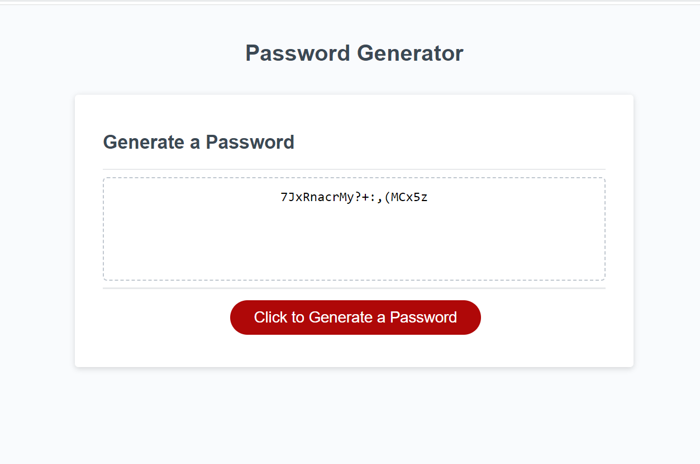

# Password-Generator

## Description: 
Pasword Generator is an application which can be used to generate a random password from a chosen criteria. The criteria includes UPPERCASE Letters, lowercase letters,
Special Characters and Numbers. This project was provided with the starter code which includes dynamically updated HTML and CSS powered by JavaScript code that I have written. This application has a clean and polished user interface that is responsive, ensuring that it adapts to multiple screen sizes.

## User Story:
The application should generate a password when a user clicks generate password button.

## Acceptance Criteria: 
1. When Generate Password Button is clicked:
- Present a series of prompts for password criteria.
- Length of password should be chosen between 10 and 64 characters.
2. Charcter Types:
- Uppercase Characters.
- Lowercase Characters.
- Special Characters.
- Numeric.
3. Code should validate for each input and at least one character type should be selected.
4. Once prompts are answered then the password should be generated and displayed in an alert or written to the page.

## You can visit the Deployed Application here: 
## Mock- up :
The following image shows the web application's appearance and functionality:

